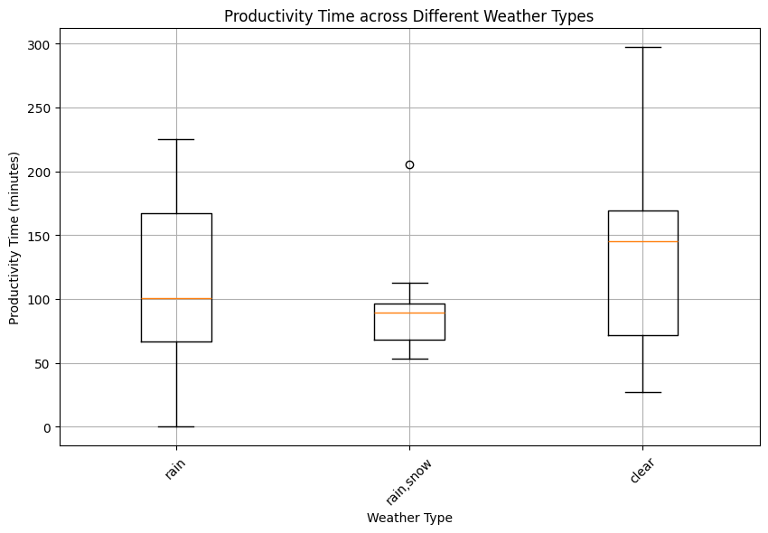
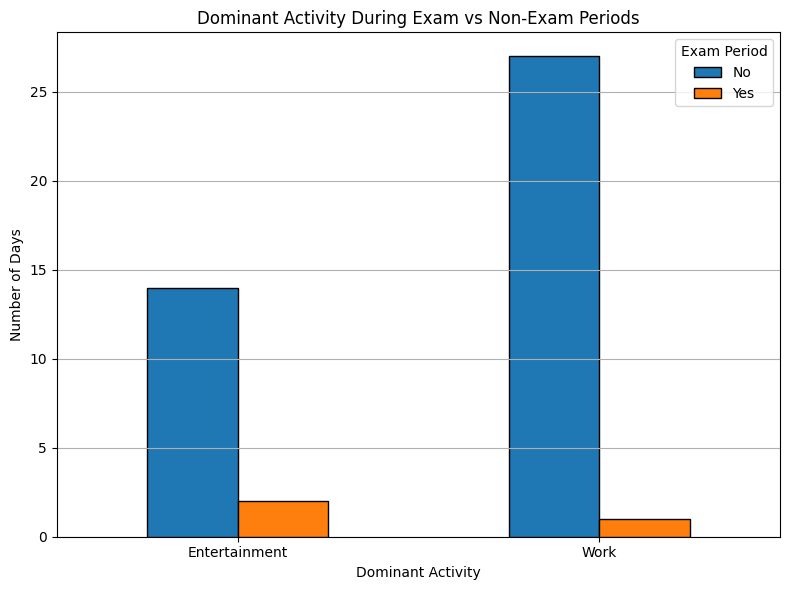
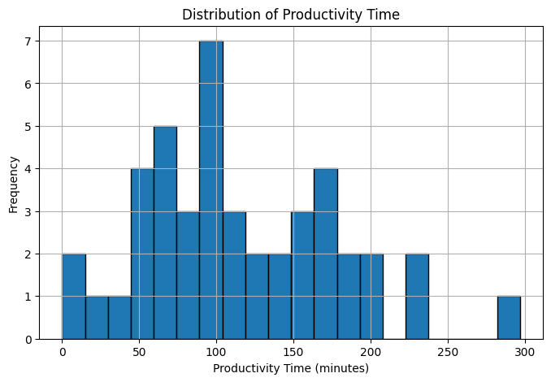
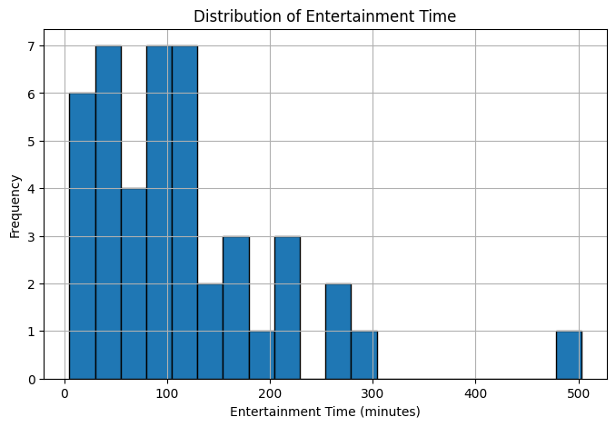
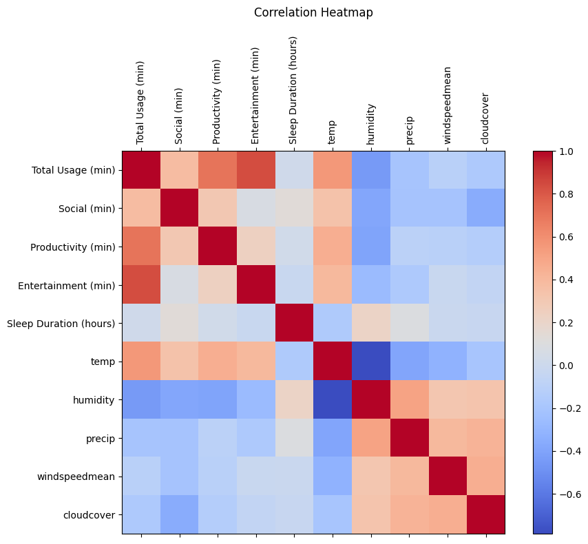

# 📄 Detailed Results and Interpretation

## 1. 📈 ANOVA Test – Weather vs Productivity

**Test:** One-way ANOVA  
**Groups compared:** Rainy days, Rain+Snow days, Clear days  
- **F-statistic:** 1.131  
- **p-value:** 0.3325  

### ✅ Interpretation:
There is **no statistically significant** difference in productivity time across different weather conditions.

➤ We **fail to reject the null hypothesis (H₀)** — this suggests that weather type (in this dataset) does not have a strong measurable impact on work-related app usage.

📦 **Boxplot:**

---

## 2. 🔍 Chi-Square Test – Exam Period vs Dominant Activity

**Test:** Chi-Square Test of Independence  
**Variables:**  
- Exam Period (Yes/No)  
- Dominant Activity (Work vs Entertainment)

- **Chi-square statistic:** 0.259  
- **p-value:** 0.6110  

### ✅ Interpretation:
There is **no statistically significant** relationship between whether it's an exam period and whether a day is work-dominant or entertainment-dominant.

➤ We **fail to reject the null hypothesis (H₀)** — suggesting that the exam period, in this case, does not shift behavior significantly from entertainment to work or vice versa.

📊 **Bar Chart:**

---

## 📈 Additional Visual Insights

### Distribution of Productivity Time

### Distribution of Entertainment Time

### Correlation Heatmap
Shows the relationship between productivity, screen activity types, and weather-related features:

---

> 🚀 These findings are preliminary and context-specific. Further analysis with more diverse data and ML techniques will strengthen interpretation.
